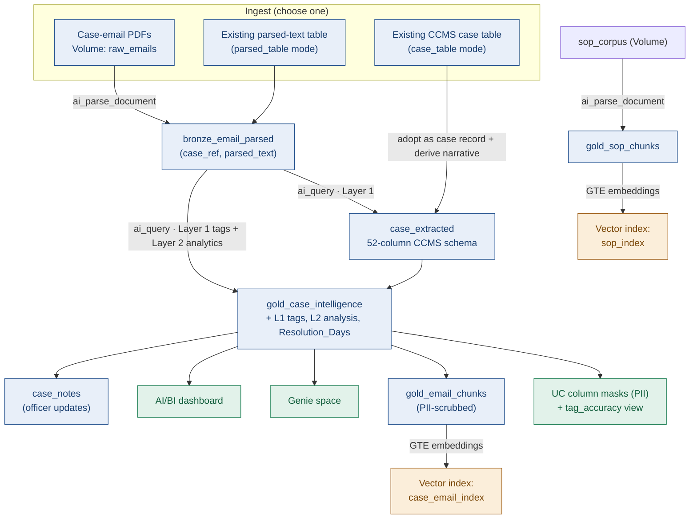
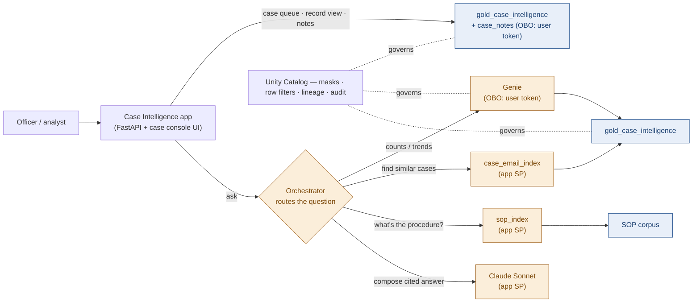

# Architecture

Consular Case Intelligence turns case-email threads into structured, analysable intelligence,
then serves it through Genie, an AI/BI dashboard, and a governed app. Unity Catalog governs every
stage.

## Build-time flow — from documents to intelligence

## Runtime flow — an officer uses the app

## Auth model (hybrid OBO)

| Path | Runs as | Why |
|------|---------|-----|
| SQL reads/writes (cases, notes) | **User (OBO)** — `x-forwarded-access-token`, scope `sql` | UC column masks & row filters evaluate against the *real viewer* |
| Genie (NL analytics) | **User (OBO)** — scope `dashboards.genie` | Same per-viewer governance on the case table |
| Vector Search (similar cases, SOPs) | App service principal | Shared inference over PII-scrubbed / non-PII text |
| Claude LLM (routing + compose) | App service principal | Shared inference, no PII |

## Layers (per the PRD)

- **Layer 1 — structured annotation tags:** country, mission/unit, case type, external agencies,
  situational flags, status. Evidence-only (a tag is applied only when the narrative supports it).
- **Layer 2 — qualitative analytics:** summary & pathway, assistance requested vs provided,
  complications & delays, external resources engaged, lessons learnt.
- **Layer 3 — insights:** dashboard views (case-type by country, handling volume, resolution
  timelines, situational-flag trends, agency co-involvement).
